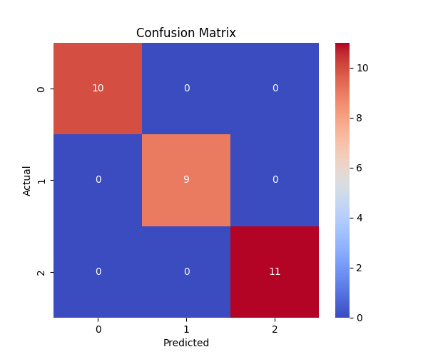
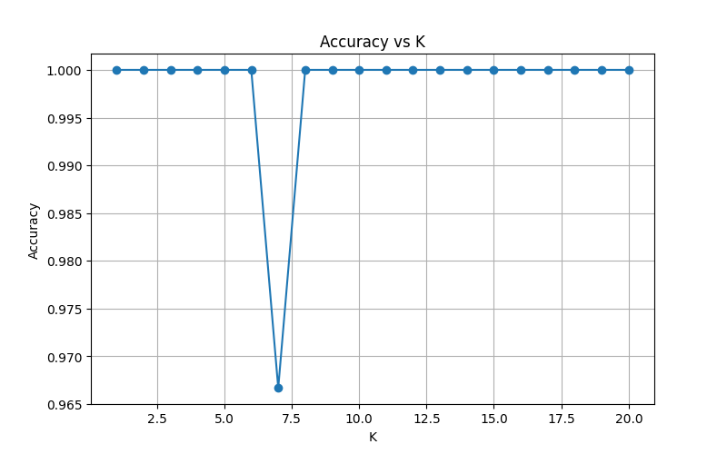

# KNN Iris Classification Project

## Overview
This project demonstrates the use of the K-Nearest Neighbors (KNN) algorithm to classify flowers in the Iris dataset.

The goal is to predict the species of a flower based on its features such as sepal length, sepal width, petal length, and petal width.

## Algorithm Explanation
KNN (K-Nearest Neighbors) is a simple machine learning algorithm.

It works by finding the K closest data points to a new sample and assigning the class based on the majority vote.

## Steps Performed
1. Load the Iris dataset  
2. Split the data into training and testing sets  
3. Train a KNN model  
4. Evaluate model accuracy  
5. Generate predictions  
6. Create a confusion matrix  
7. Plot accuracy vs K values  

## Results

### Confusion Matrix

### Accuracy vs K

## How to Run
Run the script using Python:
python iris_knn.py

## Requirements
numpy  
matplotlib  
seaborn  
scikit-learn

## AI Usage
This project was developed with the assistance of AI tools.
All implementation and final decisions were made by the students.

## Summary
In this project, we used the KNN algorithm to classify the Iris dataset.

The model performed well, and we observed that different K values affect the accuracy.

## Authors
Yael & Shir
